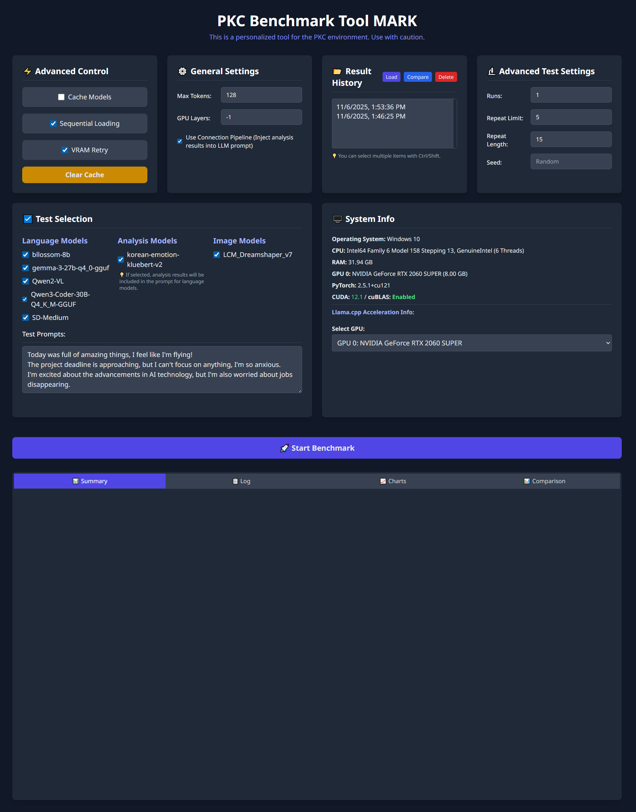
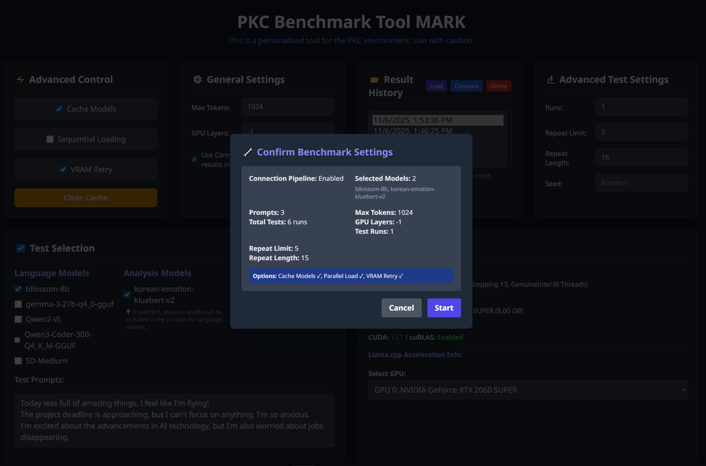
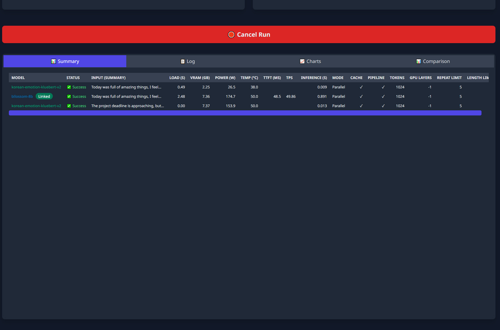
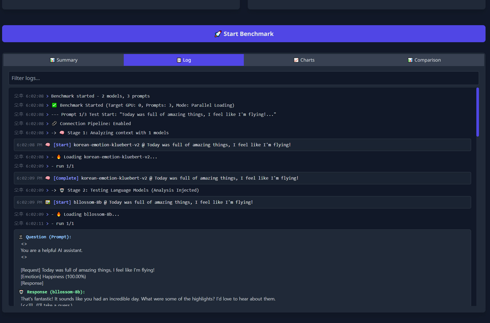
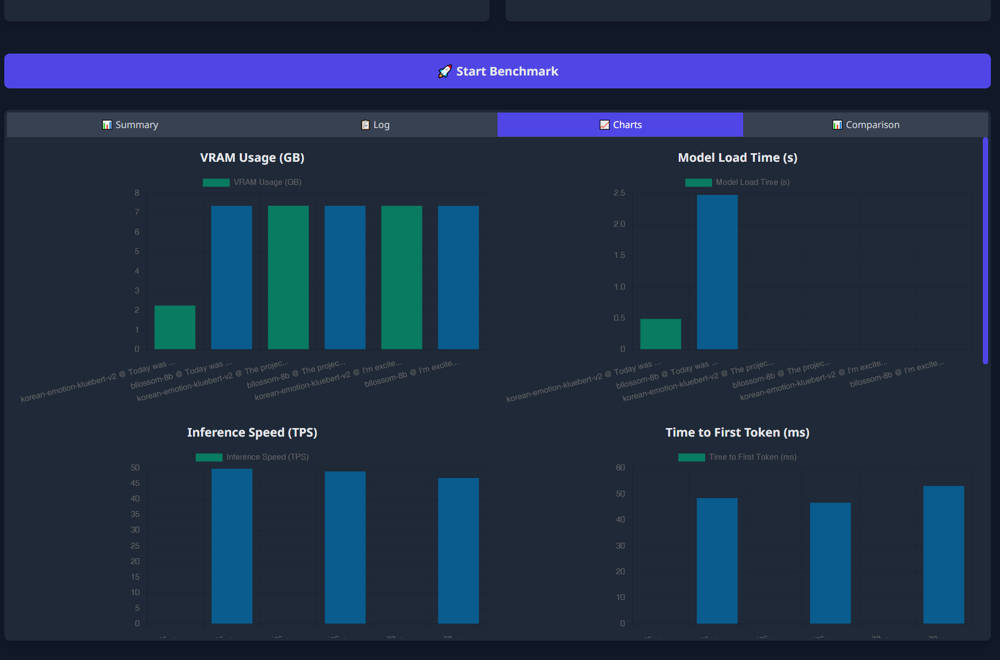
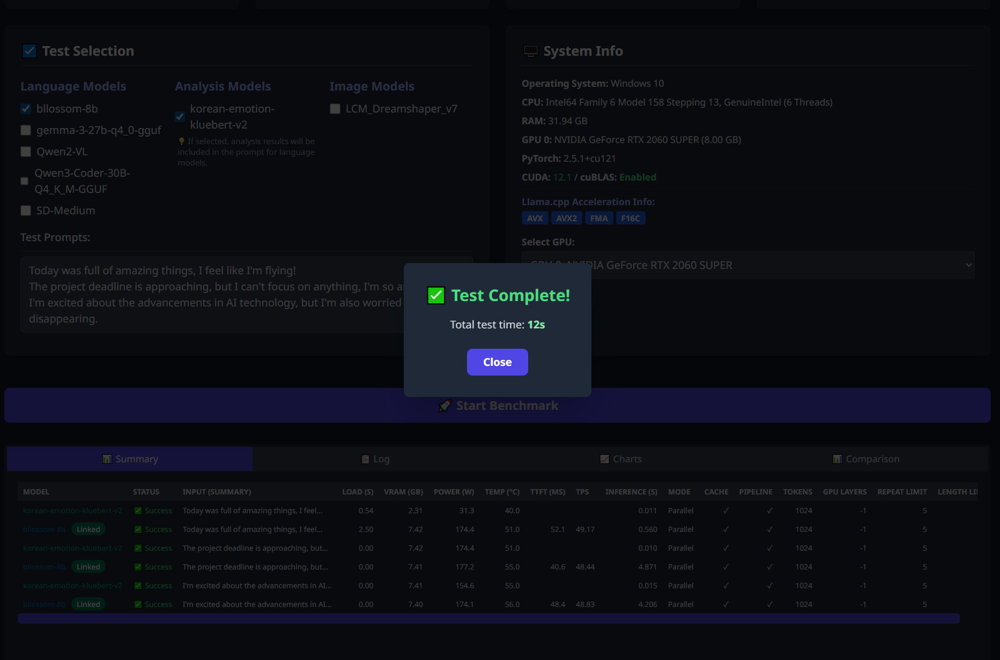
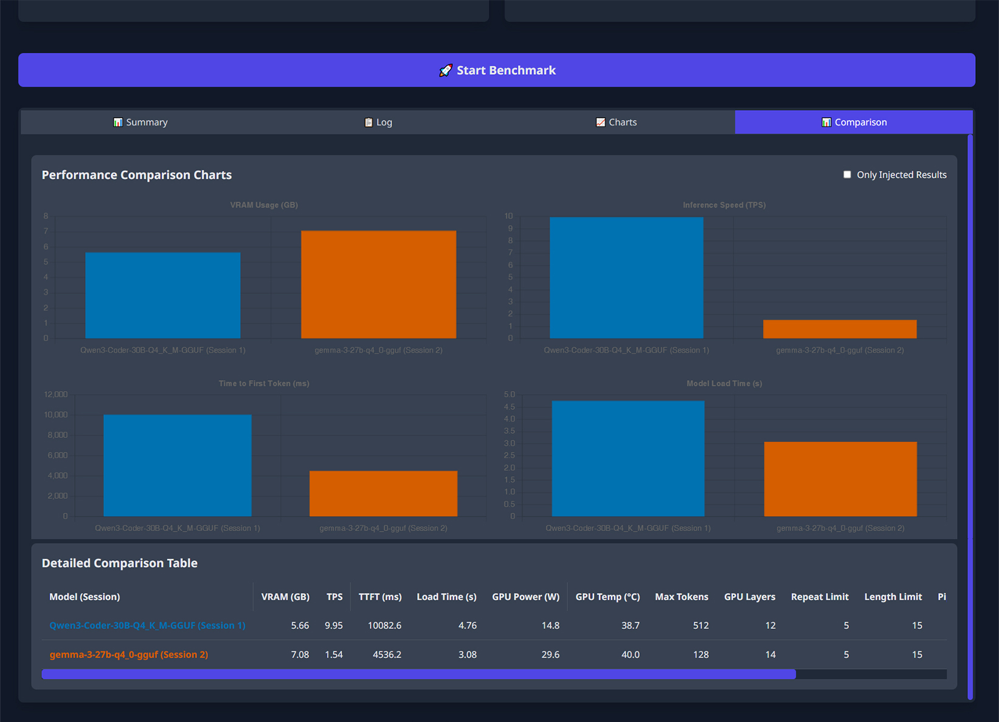

<h1 align="center">🧩 PKC MARK Benchmark Tool Beta V0.9</h1>
<h3 align="center">🚀 Local AI Model Benchmarking for Everyone — even non-experts</h3>

<p align="center">
  <b>Simple • Visual • Accessible</b><br>
  Measure, compare, and analyze your local AI models without coding knowledge.
</p>

---

## ✨ Overview

**PKC MARK** is a **local AI benchmarking tool** that helps you test and compare **LLM, GGUF, Transformers** models with ease.
Originally built as part of a multimodal chatbot project, it has evolved into a public open-source platform — designed not just for engineers,
but also for **AI enthusiasts and non-experts** who want to explore their models intuitively.

> ⚠️ **Note:** This tool was created by a non-professional developer.
> Please keep that in mind when using it — functionality and stability may vary depending on your system environment.

---

## 💡 Why PKC MARK?

Most benchmark tools require complex setup or command-line usage. PKC MARK removes that barrier.

💫If you can use a browser, you can benchmark your models — no coding or configuration headaches.

✅ **No technical background required**

✅ **Works fully offline (local)**

✅ **Auto-detects your models and type**

✅ **Visual results and real-time stats**

---

## ⚙️ Installation & Execution

1. **Clone or download** this repository.
2. **Create and activate** a virtual environment:

   ```bash
   python -m venv venv
   .\venv\Scripts\activate
   ```
3. **Install PyTorch** for your CUDA version, then other dependencies:

   ```bash
   pip install -r requirements.txt
   ```
4. **Edit `config.json`** — set your local model path:

   ```json
   {
       "results_dir": "results",
       "models_scan_path": "Enter your model path"
   }
   ```
5. **Run the server:**

   * Windows: `start_server_windows.bat`
   * Or manually:

     ```bash
     python benchmark_server.py
     ```
6. Browser will open automatically with `benchmark_canvas.html`. Start your benchmark visually 🎨

---

## ✨ Features at a Glance

* 🖥️ **Web UI** — Real-time control and visualization
* ⚡ **Auto Model Detection** — GGUF, Transformers
* 🔍 **Detailed Metrics** — VRAM, TTFT, TPS, GPU Power & Temp
* 🧩 **Pipeline Integration** — Emotion/analysis model linking
* 📊 **History & Comparison** — LocalStorage-based record tracking

---

## 🧠 Model Detection Rules

| File Type / Pattern                          | Classification               |
| -------------------------------------------- | ---------------------------- |
| `.gguf`                                      | Llama (GGUF)                 |
| `model_index.json`                           | Diffusers (image generation) |
| `config.json`                                | Transformers (text-based)    |
| Folder name includes `kluebert` or `emotion` | Analysis model               |

---

## 📜 License

* **Non-commercial / Open Source**: GPLv3
* **Commercial use**: Requires a separate license (contact: [pkc0412@gmail.com])

---

## 👩‍💻 For Everyone — Not Just Developers

Whether you’re an **AI beginner**, a **researcher**, or just **curious about model performance**, PKC MARK is made for you.
With a simple interface, you can focus on **understanding results** — not debugging scripts.

> 🧩 *"Benchmarking should be simple, transparent, and fun." — PKC*

> ⚠️ *Please note: This project was developed by a non-professional programmer. Expect occasional rough edges — but it works!* 🧡

---









---

<details>
<summary>🔖 Keywords</summary>
AI, LLM, Transformers, Diffusers, Benchmark, PKC MARK, Model Test, Local LLM, FastAPI, VRAM, TTFT, GPU Benchmark, Python AI, AI Development, ML Benchmark, AI Visualization, Local AI, AI Research, Open Source AI
</details>

---

<p align="center">
  <b>Created by PKC</b> · <a href="https://pkc0412.tistory.com/">Blog</a> · <a href="mailto:pkc0412@gmail.com">Contact</a>
</p>
